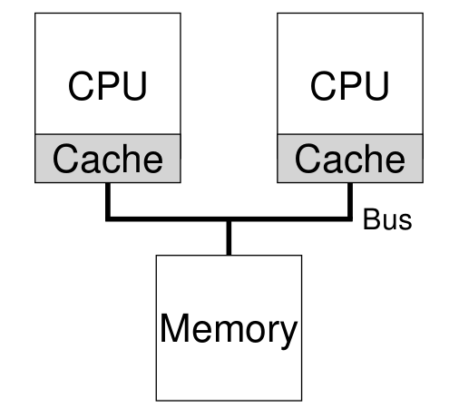

# Multiprocessor Scheduling

## 1. Background: Multiprocessor Architecture

### Cache

- temporal locality: 上一次访问的下一次可能还访问
- spatial locality: 上一次访问位置的下一次可能访问该位置的周围

This general problem is called the problem of **cache coherence**.

The basic solution is provided by the hardware: by monitoring memory accesses, hardware can ensure that basically the “right thing” happens and that the view of a single shared memory is preserved.

1. each cache pays attention to memory updates by observing the bus that connects them to main memory.
2. When a CPU then sees an update for a data item it holds in its cache, it will notice the change
3. either invalidate its copy (i.e., remove it from its own cache) or update it (i.e., put the new value into its cache too)

## 2. Don’t Forget Synchronization

mutex的使用

As the number of CPUs grows, access to a synchronized shared data
structure becomes quite slow.

## 3. One Final Issue: Cache Affinity

> A process, when run on a particular CPU, builds up a fair bit of state in the caches (and TLBs) of the CPU.

Thus, a multiprocessor scheduler should consider cache affinity when making its scheduling decisions, perhaps preferring to keep a process on the same CPU if at all possible.

## 4. Single-Queue Scheduling

SQMS: single-queue multiprocessor scheduling 

- lack of scalability: the system spends more and more time in lock
  overhead and less time doing the work the system should be doing
- cache affinity

SQMS approach is straightforward to implement. However, it does not scale well (due to synchronization overheads), and it does not readily preserve cache affinity.

## 5. Multi-Queue Scheduling

MQMS: multi-queue multiprocessor scheduling (a queue per CPU)

- it should be inherently more scalable.
- MQMS intrinsically provides cache affinity

but... load imbalance

## 6. Linux Multiprocessor Schedulers

### O(1)

multiple queues 
priority-based scheduler
similar to the MLFQ

### CFS

multiple queues
deterministic proportional-share approach
more like Stride scheduling

### BFS

single queue
proportional-share
more complicated scheme

## 7. Summary

We have seen various approaches to multiprocessor scheduling. 

The single-queue approach (SQMS) is rather straightforward to build and balances load well but inherently has difficulty with scaling to many processors and cache affinity. 

The multiple-queue approach (MQMS) scales better and handles cache affinity well, but has trouble with load imbalance and is more complicated. 

Whichever approach you take, there is no simple answer: building a general purpose scheduler remains a daunting task, as small code changes can lead to large behavioral differences. 

Only undertake such an exercise if you know exactly what you are doing, or, at least, are getting paid a large amount of money to do so.